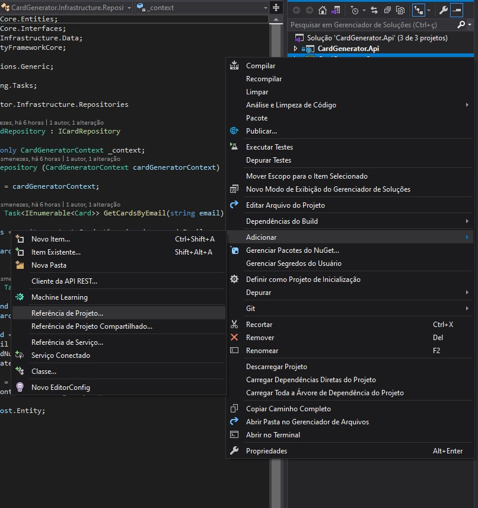

# Gerador de Cartão de Crédito

A API deverá gerar números aleatórios para o pedido de novo cartão. Cada cartão gerado deve estar associado a um email para identificar a pessoa que está utilizando.
Essencialmente são 2 endpoints. Um receberá o email da pessoa e retornará um objeto de resposta com o número do cartão de crédito. E o outro endpoint deverá listar, em ordem de criação, todos os cartões de crédito virtuais de um solicitante (passando seu email como parâmetro).

### Para o desenvolvimento dessa api dividimos nossa aplicação em 3 camadas

**API:**
 Onde ficará o Controller.

**Core:**
Entidades e Interfaces.

**Infrastructure:**
Data e Repositories.

Agora iremos permitir o que cada camada poderá enxergar :

Clicando como botão direito do mouse encima de cada projeto criado iremos na opção:

**Adicionar => Referência de Projeto...**

(Exemplo API)

API poderá ter referências do CORE e INFRASTRUCTURE 
INFRASTRUCTURE poderá ter referências do CORE
e o CORE ore não referenciará nenhum outro projeto. 

Em uma explicação rápida, Entities seriam o equivalente ao nosso Core. Contentendo nossas entidades e interfaces, sem enxergar nada fora isso. 

Usecases seria o nosso infrastructure contendo nossa regra de negócio e enxergando o Entities. 

Controllers seria o nosso API. Contendo os controllers da nosa api, e enxergando tanto o nosso Core quanto nosso Infrastructure.

### Começaremos desenvolvendo nossa entidade Card Localizada no CORE 

E instalaremos as seguintes dependências na nossa Layer de INFRASTRUCTURE 

 e a seguinte dependência no API 

E no SQL Server Object Explorer iremos criar nosso Banco de dados manualmente 

E iremos rodar nossa query para criar a tabela Card e seus atributos
O script estará disponível na pasta SCRIPTS 

Após isso executaremos o SCAFFOLD para gerar nosso DBContext

Scaffold-DbContext "Server=(localdb)\MSSQLLocalDB;Database=SocialMedia;Integrated Security = true" Microsoft.EntityFrameworkCore.SqlServer -OutputDir Data

Gerando assim nossa base de dados. 

Agora iremos configurar nosso startup para fazer a conexão com o banco. 

(app.settings)

### Para desenvolvermos nosso repositório utilizaremos o conceito de injeção de dependência, como na imagem a seguir  

## E também o conceito de interface 

Para que enfim possamos implementar a busca do cartão por email, e a geração de novos cartões de crédito apartir do email

Criaremos um novo controller e utilizaremos injeções de dependência para fazer a conexão do Repositório com o Controller

E enfim criando nossos endpoints

